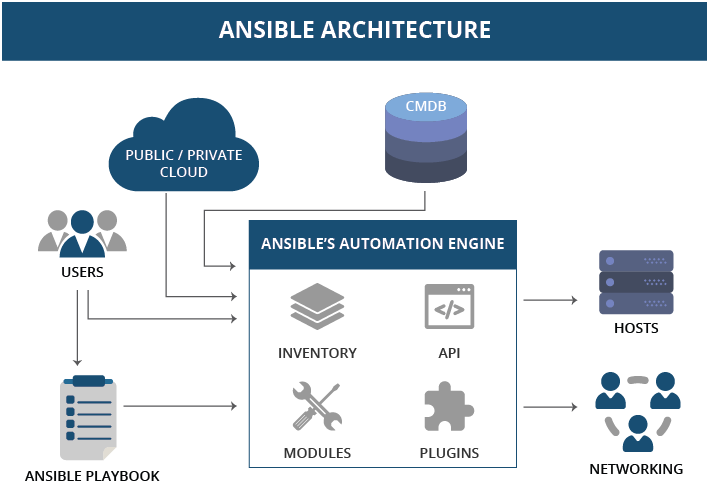

# Ansible 가이드

Ansible 은 시스템을 구성하고, 소프트웨어를 배포하고, 지속적인 배포 또는 제로 다운 타임 롤링 업데이트와 같은 
고급 IT 작업을 조율 할 수 있습니다.

*Ansible Use Case*
1. AWS AMI 와 같이 복잡한 작업 세트를 순차적으로 실행 하여 한번에 빌드 하는 작업
2. 다수의 관리 대상 노드에 대해 동일한 작업 세트를 동시에 진행 하는 일괄 작업


## Ansible 아키텍처




### Control node
Ansible 이 설치 되어 실행 할 수 있는 디바이스 입니다. (예: 개발자 PC)


### Managed nodes
Ansible 로 관리 해야 하는 대상 디바이스들 입니다. (예: EC2, 네트워크 장치 등)  
Managed node 는 때때로 호스트(host)라고도 한다.


### Inventory
관리 목적에 따라 Managed node 정보를 그룹핑 하여 관리 합니다.(예: front, api, nginx, mysql)
인벤토리의 설정 파일의 기본 위치는 Control node 의 /etc/ansible/hosts 입니다.
```shell
# /etc/ansible/hosts
[all:vars]
ansible_ssh_private_key_file=/Users/myname/accesskey.pem
ansible_user=ubuntu

[stage-ec2]
webserver-11.mydomain.net
webserver-18.mydomain.net
webserver-[021:030].mydomain.net

[poc-ec2]
db01.intranet.mydomain.net
db02.intranet.mydomain.net
10.25.1.56
10.25.1.57
```

### Playbooks
[Playbook](https://docs.ansible.com/ansible/latest/user_guide/playbooks_intro.html) 은 순서가 지정된 작업 목록(roles)으로, 
순차적으로 실행할 수 있습니다. Playbook 에는 role 과 variables 를 포함할 수 있습니다.

### Tasks
Ansible 의 작업 단위 입니다.
ad-hoc 명령을 사용하여 단일 작업을 한 번 실행할 수 있다. 

### Modules
Ansible 코드의 실행 단위 입니다. 

각 모듈은 특정 유형의 데이터베이스에서 사용자를 관리하는 것부터 특정 유형의 네트워크 장치에서 VLAN 인터페이스 관리까지 특정한 용도로 사용됩니다.
Ansible 에 포함된 기본 모듈을 확인 하려면 [모듈 목록](https://docs.ansible.com/ansible/latest/collections/all_plugins.html) 을 확인 하세요.


## Example 


### Playbook
관리 노드 그룹 Stage 의 EC2 인스턴스들에 대해 nginx 를 구성하고,  
관리 노드 그룹 PoC 의 EC2 인스턴스들에 대해 jdk11 과 code-deploy-agent 를 구성하는 playbook 예시 입니다.

```shell
---
- hosts: stage-ec2
  roles:
   - nginx

---
- hosts: poc-ec2
  roles:
   - jdk11
   - code-deploy-agent
```


### Role
[Role](https://docs.ansible.com/ansible/latest/user_guide/playbooks_reuse_roles.html) 은 하나의 작업 단위로, 
role 디렉토리를 중심으로 tasks, vars, handlers, fiels, templates, meta 의 하위 디렉토리가 자동으로 조합 되어 처리를 진행 합니다.

```shell
example
├── files
├── handlers
├── meta
├── tasks
│   └── main.yml
├── templates
└── vars
```

### tasks
[Task](https://docs.ansible.com/ansible/latest/user_guide/playbooks_reuse_roles.html) 는 작업을 정의 합니다.

아래 샘플은 os_family 에 해당하는 작업 파일을 import 하여 실행 합니다.
```shell
# roles/example/tasks/main.yml
- name: Install httpd server for Redhat
  import_tasks: redhat.yml
  when: ansible_facts['os_family']|lower == 'redhat'

- name: Install httpd server for Ubuntu
  import_tasks: debian.yml
  when: ansible_facts['os_family']|lower == 'debian'

# roles/example/tasks/redhat.yml
- name: Install httpd server
  yum:
    name: "httpd"
    state: present

# roles/example/tasks/debian.yml
- name: Install httpd server
  apt:
    name: "apache2"
    state: present
```  


### handlers
주로 service 등록 / 구동 / 중지 등의 처리를 위해 사용합니다.

handlers 실행은 tasks 의 *notify* 호출로부터 시작 됩니다. notify 는 handler 의 name 속성이나 listen 속성에 대해 call 합니다.

```shell
# roles/example/tasks/main.yml
tasks:
  - name: Restart middleware services
    command: echo "this task will restart the web services"
    notify: "restart middleware"

# roles/example/handlers/main.yml
handlers:
  - name: Restart memcached
    service:
      name: memcached
      state: restarted
    listen: "restart middleware"

  - name: Restart apache
    service:
      name: httpd
      state: restarted
    listen: "restart middleware"

```

### vars
tasks 스콥(scope)에서만 사용할 변수를 정의합니다.
정적 변수와 facts 정보를 기반으로 동적 변수를 설정할 수 있습니다.

```shell
# roles/example/vars/main.yml
---
version: 1.0
os_name: "{{ 'CentOS' if ansible_distribution == 'CentOS'
          else 'Amazon' if ansible_distribution == 'Amazon'
          else 'Unkown' }}"
httpd_service: "{{ 'apache2' if ansible_distribution == 'CentOS'
          else 'httpd' if ansible_distribution == 'Amazon'
          else 'httpd' if ansible_distribution == 'Debian'
          else 'Unkown' }}"
```

### meta
현재 role 의 정보, 의존 하는 role 등을 정의합니다.

```shell
# roles/example/meta/main.yaml
---
info:
  author: symplesims
  description: OS Hardening for Linux
  license: "OOO License"
  
dependencies:
  - { role: httpd, port: 80 }
  - { role: mysql, dbname: blog, charset: utf8 }
```

### files
tasks 작업에서 참조할 파일(예: shell, sql, cert, ...)이 위치 합니다.

```shell
# roles/example/files/script.sh

# roles/example/tasks/main.yml
---
- name: execute custom configuration
  script: script.sh
```

### templates
httpd.conf 와 설정 파일과 같이 참조할 템플릿 파일이 위치 합니다.

```shell
# roles/example/templates/httpd.conf.j2

# roles/example/tasks/main.yml
- name: httpd configuration
  template:
    src=templates/httpd.conf.j2
    dest=/etc/httpd/conf/httpd.conf
    owner=root
    group=root
    mode=0755
```

### Facts
gather facts 오퍼레이션을 통해 Managed nodes 들의 환경 정보를 수집하여 Playbook 에서 활용 합니다.

다음과 같이 Managed node 의 [Facts](https://docs.ansible.com/ansible/latest/user_guide/playbooks_vars_facts.html) 정보를 통해 세밀한 작업을 제어 할 수 있습니다.

```shell
# playbook.yaml 
- hosts: all
  remote_user: root
  gather_facts: true # default 값이 true 이므로 facts 정보를 조회 합니다. 성능을 높이려면 이 값을 no 로 설정 하세요.
  roles:
    - os-hardening

# roles/os-hardening/tasks/main.yaml
--- 
tasks:
  - name: Execute os-specific task for ubuntu
  import_tasks: "ubuntu.yml"
  when: ansible_distribution |lower == 'ubuntu'

  - name: Execute os-specific task for redhat
  import_tasks: "redhat.yml"
  when: ansible_distribution |lower == 'redhat'
```

- ansible <target_host> -m ansible.builtin.setup 명령을 통해 facts 환경 변수를 확인 할 수 있습니다.

```shell
# sample output 
{
  ...
    ,
    "ansible_distribution": "CentOS",
    "ansible_distribution_file_parsed": true,
    "ansible_distribution_file_path": "/etc/redhat-release",
    "ansible_distribution_file_variety": "RedHat",
    "ansible_distribution_major_version": "7",
    "ansible_distribution_release": "Core",
    "ansible_distribution_version": "7.5.1804", 
    "ansible_effective_group_id": 1000,
    "ansible_effective_user_id": 1000,
    "ansible_dns": {
        "nameservers": [ "127.0.0.1" ]
    },
  ...
}
```

### 디렉토리 레이아웃

Ansible  [Directory Layout](https://docs.ansible.com/ansible/latest/user_guide/sample_setup.html) 은
유연하고 확장 가능한 playbook 구성이 용이 합니다.

### 참고 
Ansible 아키텍처와 내부 동작 방식에 대해서 [19 Minutes With Ansible](https://sysadmincasts.com/episodes/43-19-minutes-with-ansible-part-1-4) 영상이 도움이 됩니다.
